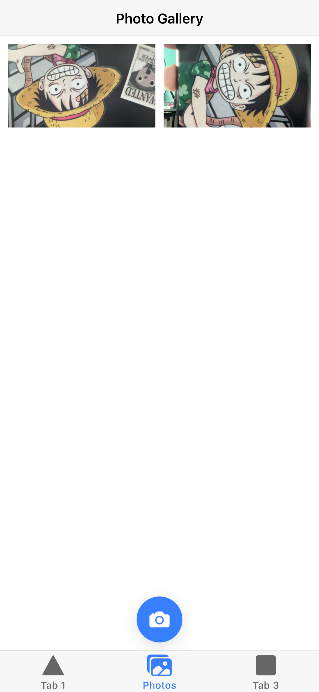

# Ionic starter

Photo Gallery by Ionic/React.js/TypeScript



## Quick started

```sh
# ionic global env
# npm install -g @ionic/cli native-run cordova-res

# install dependencies
npm i

# start
ionic serve

# build
ionic build

# build ios
ionic cap add ios

# build android
ionic cap add android
```

## Credit

- [Create an Ionic React App](https://ionicframework.com/docs/react)
